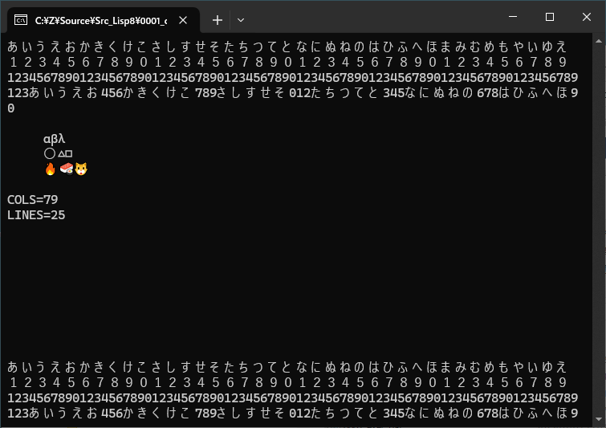
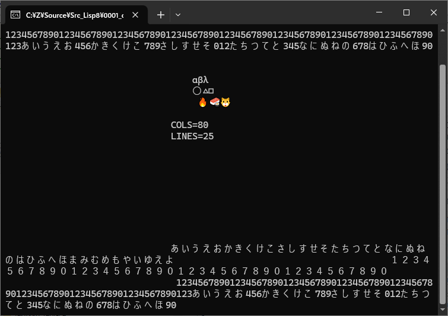
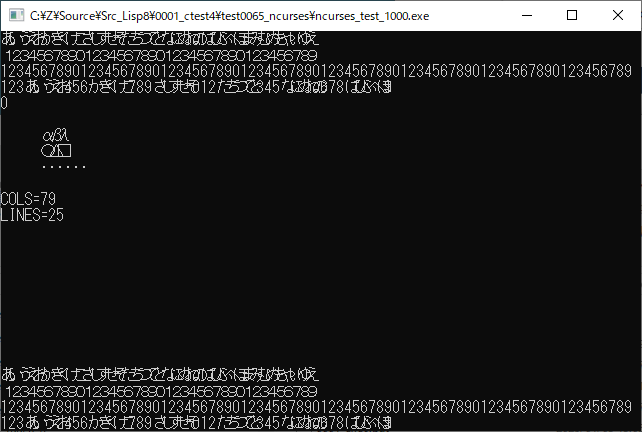
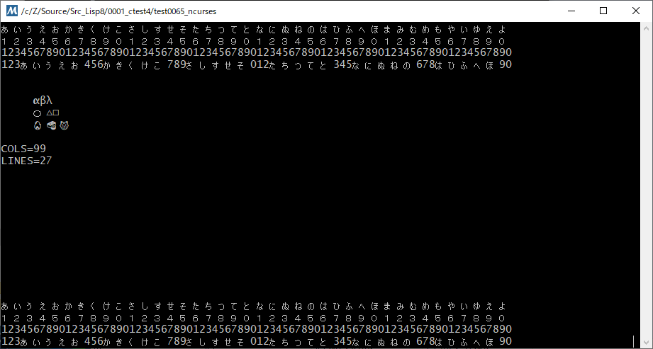

# win_ncurses_test

## 概要
- Windows 上で、ncurses を使用するテストプログラムです。


## インストール方法
1. MSYS2/MinGW-w64 (64bit) のインストール  
   事前に MSYS2/MinGW-w64 (64bit) がインストールされている必要があります。  
   以下のページを参考に、開発環境のインストールを実施ください。  
   https://gist.github.com/Hamayama/eb4b4824ada3ac71beee0c9bb5fa546d  
   (すでにインストール済みであれば本手順は不要です)  
   (記事が古いので、現状と合っていないかもしれない)

2. ncurses のインストール  
   プログラムメニューから MSYS2 の MinGW 64bit Shell を起動して、  
   以下のコマンドを実行してください。
   ```
   pacman -S mingw64/mingw-w64-x86_64-ncurses
   ```

3. 本プログラムのコンパイル  
   0000_compile.bat を (ダブルクリック等で) 実行してください。

4. 本プログラムの実行  
   0001_exec.bat を (ダブルクリック等で) 実行してください。


## 実行結果
1. Windows Terminal 上での実行結果 **OK**  
   ( かなり良さそう )  
   

2. Windows Terminal 上での実行結果 **NG**  
   ( `resize_term(LINES, COLS - 1);` を実行しないとこうなる)  
   

3. コマンドプロンプト上での実行結果 **NG**  
   ( 安定のこわれっぷり )  
   

4. MSYS2 の mintty  
   ( 大丈夫そう? )  
   


## ノウハウ等
1. 日本語表示には ncursesw のリンクが必要。  
   また、`#define NCURSES_WIDECHAR 1` を記述しないと、mvaddwstr() 等が使えない。  

2. `resize_term(LINES, COLS - 1);` を実行して、幅を 1 文字分狭くしないと、  
   日本語の表示がずれる。(実行結果の 2. 参照)


## TODO
1. キー入力の確認
2. マウス入力の確認
3. 画面サイズの変更の対応


## 環境等
- OS
  - Windows 10 (version 22H2) (64bit)
- 環境
  - MSYS2/MinGW-w64 (64bit) (gcc version 14.2.0 (Rev2, Built by MSYS2 project))


## 履歴
- 2025-1-3 v1.00 (初版)


(2025-1-3)
